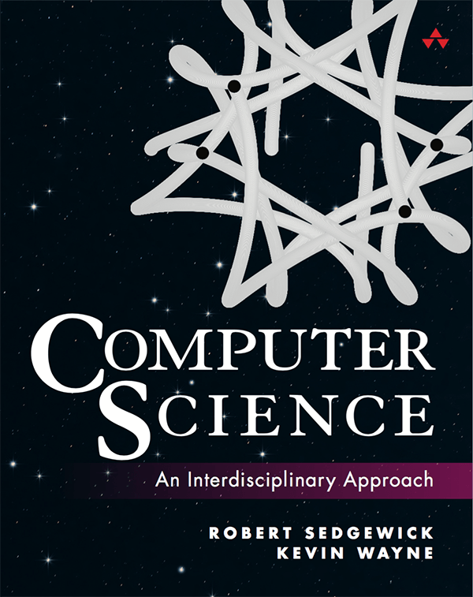

# (AP) Computer Science A
{: .no_toc }

## Overview
AP Computer Science A (AP CSA) is an introductory college-level computer science course focused on programming using the Java language. It's designed to be equivalent to a first-semester college computer science course. Students learn to analyze, write, and test code while exploring concepts like modularity, variables, and control structures. The course emphasizes object-oriented programming and design
## Text Book

## 2025 Fall Pacing Guide

| Topic                                               | Lecture              | Slides               | Lab/HW               |Duration|
|:----------------------------------------------------|:---------------------|:---------------------|:---------------------|:---|
| **Unit 1 Using Objects and Methods**                |||| 32 ~ 34 Class Period |
| 1.1 Introduction                                    ||| [Lab 1]              ||
| 1.2 Varialbe & Data Type                            ||| [Lab 2]              ||
| 1.3 Expression and Output                           ||| [Lab 3]              ||
| 1.4 Assignment and Input                            |||||
| 1.5 Casting and Range of Variables                  |||||
| 1.6 Compound Assignment Operator                    |||||
| 1.7 Method Signature and Class Method               |||||
| 1.8 Math Class and APIs                             |||||                               
| 1.9 API and Libraries                               |||||
| 1.10 Objects                                        |||||
| 1.11 Objects Creation and Storage                   |||||
| 1.12 Calling Instance Methods                       |||||
| 1.13 String Manipulation                            |||||
| 1.14 Documentation with Comments                    |||||
| **Unit 2 Selection and Iteration**                  ||                      | | 29 ~ 31 Class Period |
| 2.1 Algorithms with Selection and Repetition        |||||
| 2.2 Boolean,if and nested if Statements             |||||
| 2.3 Compound Boolean Expressions                    |||||
| 2.4 Comparing Boolean Expressions                   |||||
| 2.5 While/ For Loops                                |||||
| 2.5 Implementing Selection and Iteration Algorithms |||||
| 2.6 Implementing String Algorithms                  |||||
| 2.7 Nested Iteration                                |||||
| 2.8 Informal Run-Time Analysis                      |||||

### Fall Semester Evaluation

| Class Participation | Lab/HW|Attendence |Midterm |Final Exam | Final Project |
|--:|-----:|------:|---:|---:|--:|
| 10%| 20%|10%|20%|20%|20%|

## 2025 Spring

| Topic                                        | Lecture          |Slides|Lab/HW|
|:---------------------------------------------|:------------------|:------|:---|
| **Unit 3 Class Creation**                    |||| 20 ~ 22 Class Period |
| 3.1 Abstraction and Program Design           |||||
| 3.2 Impact of Program Design                 |||||
| 3.3 Anatomy of a Class                       |||||
| 3.4 Constructor                              |||||
| 3.5 Methods: How to write them               |||||
| 3.6 Methods: Passing and Returing References |||||
| 3.7 Class Variables and Methods              |||||
| 3.8 Scope and Access                         |||||
| 3.9 *this* Keyword                           |||||
| **Unit 4 Data Collection**                   ||||50 ~ 52 Class Period|
| 4.1 Ethical and Social Issues Around Data Collection |||||
|4.2 Introduction to Using Data Sets |||||
|4.3 Array Creation and Access |||||
|4.4 Array Traversals |||||
|4.5 Implementing Array Algorithms |||||
|4.6 Using Text Files |||||
|4.7 Wrapper Classes |||||
|4.8 ArrayList Methods |||||
|4.9 ArrayList Travelsals |||||
|4.10 Implementing ArrayList Algorithms |||||
|4.11 2D Array Creation and Access |||||
|4.12 2D Array Traversals |||||
|4.13 Implementing 2D Array Algorithms |||||
|4.14 Searching Algorithms |||||
|4.15 Sorting Algorithms |||||
|4.16 Recursion |||||
|4.17 Recursive Searching and Sorting |||||

### Spring Semester Evaluation

| Class Participation | Lab/HW|Attendence |Midterm |Final Exam | Final Project |
|--:|-----:|------:|---:|---:|--:|
| 10%| 20%|10%|20%|20%|20%|

## Lab instruction
## References

[Lab 1]: 
[Lab 2]: 
[Lab 3]: 

