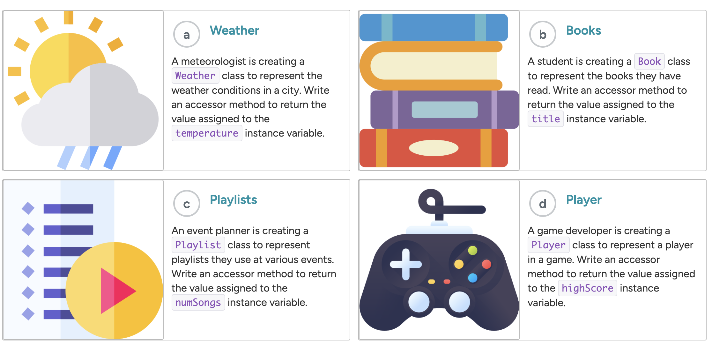

# Lab Class Creation: accessor methods
{: .no_toc }
## Goals:
{: .no_toc }
* Able to create accessor methods of class




## Task Summary
{: .no_toc .text-delta }
1. TOC
{:toc}


## Task A: Weather Runner
A meteorologist is creating a Weather class to represent the weather conditions in a city.

Easy
{: .label .label-green }

* ✅ TO DO #1: Write an accessor method called getTemperature() in the Weather class to return the value assigned to the temperature instance variable.
* ✅ TO DO #2: In WeatherRunner.java, call the accessor method on the dallasWeather object and print the result.

```java

public class WeatherRunner {
    public static void main(String[] args) {

        /* ----------------------------------- TO DO -----------------------------------
         * ✅ Call the accessor method on the dallasWeather object and print the result.
         * -----------------------------------------------------------------------------
         */
        // Creates a Weather object
        Weather dallasWeather = new Weather(92.5);
    }
}

/*
 * Represents the weather conditions in a city
 */
public class Weather {

    private double temperature;   // The temperature in a city
    /*
     * Sets temperature to the specified temperature
     */
    public Weather(double temperature) {
        this.temperature = temperature;
    }

    /* ----------------------------------- TO DO -----------------------------------
     * ✅ Write an accessor method to return the value assigned to temperature.
     * -----------------------------------------------------------------------------
     */
    
}
```

## Task B: Book Runner
A student is creating a Book class to represent the books they have read.

Easy
{: .label .label-green }

* ✅ TO DO #1: Write an accessor method called getTitle() in the Book class to return the value assigned to the title instance variable.
* ✅ TO DO #2: In BookRunner.java, call the accessor method on the theGiver object and print the result.

```java
public class BookRunner {
    public static void main(String[] args) {

        /* ----------------------------------- TO DO -----------------------------------
         * ✅ Call the accessor method on the theGiver object and print the result.
         * -----------------------------------------------------------------------------
         */

        // Creates a Book object
        Book theGiver = new Book("The Giver");

    }
}
    /*
     * Represents a book a student has read
     */
    
public class Book {
        private String title;    // The title of a book
        /*
         * Sets title to the specified title
         */
        public Book(String title) {
            this.title = title;
        }
        /* ----------------------------------- TO DO -----------------------------------
         * ✅ Write an accessor method to return the value assigned to title.
         * -----------------------------------------------------------------------------
         */
}

```


## Task C: Playlist
An event planner is creating a Playlist class to represent a playlist they use at various events.

Easy
{: .label .label-green }

* ✅ TO DO #1: Write an accessor method called getNumSongs() in the Playlist class to return the value assigned to the numSongs instance variable.
* ✅ TO DO #2: In PlaylistRunner.java, call the accessor method on the birthdayPlaylist object and print the result.

```java
public class PlaylistRunner {
  public static void main(String[] args) {
    /* ----------------------------------- TO DO -----------------------------------
     * ✅ Call the accessor method on the birthdayPlaylist object and print the result.
     * -----------------------------------------------------------------------------
     */
    // Creates a Playlist object
    Playlist birthdayPlaylist = new Playlist(28);
  }
}
/*
 * Represents a playlist used at an event
 */
public class Playlist {
    private int numSongs;    // The number of songs in a playlist
    /*
     * Sets numSongs to the specified number of songs
     */
    public Playlist(int numSongs) {
        this.numSongs = numSongs;
    }
    /* ----------------------------------- TO DO -----------------------------------
     * ✅ Write an accessor method to return the value assigned to numSongs.
     * -----------------------------------------------------------------------------
     */
}
```

## Task D: Game Runner
A game developer is creating a Player class to represent a player in a game.

Easy
{: .label .label-green }
* ✅ TO DO #1: Write an accessor method called getHighScore() in the Player class to return the value assigned to the highScore instance variable.
* ✅ TO DO #2: In GameRunner.java, call the accessor method on the tetrisChamp object and print the result.

```java
public class GameRunner {
    public static void main(String[] args) {
        /* ----------------------------------- TO DO -----------------------------------
         * ✅ Call the accessor method on the tetrisChamp object and print the result.
         * -----------------------------------------------------------------------------
         */
        // Creates a Player object
        Player tetrisChamp = new Player(682);
    }
}

/*
 * Represents a player in a game
 */
public class Player {
    private int highScore;   // A player's high score
    /*
     * Sets highScore to the specified high score
     */
    public Player(int highScore) {
        this.highScore = highScore;
    }
    /* ----------------------------------- TO DO -----------------------------------
     * ✅ Write an accessor method to return the value assigned to highScore.
     * -----------------------------------------------------------------------------
     */
}

```