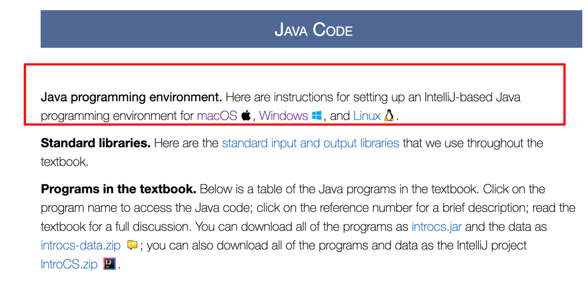
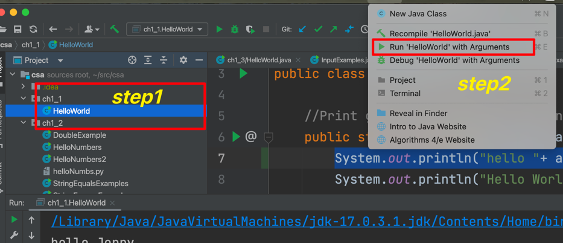
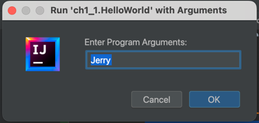
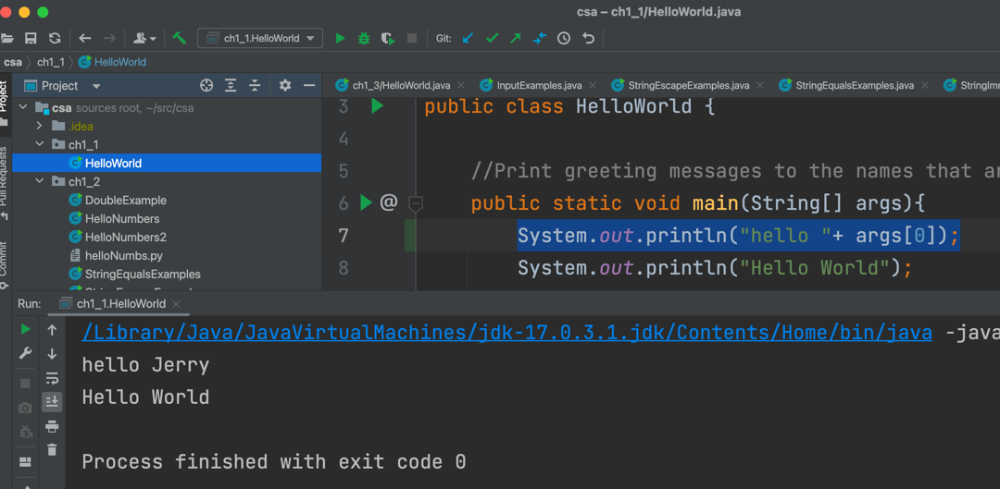

# Lab1 Hello World
{: .no_toc }

## Goals
{: .no_toc}
* Set up the development environment
* Able to compile the java program
* Able to run the java program with arguments
* Able to write program that takes input arguments

## Task Summary
{: .no_toc .text-delta }
1. TOC
{:toc}

## Get Started

### IDE and Java SDK setup
* Please follow the **step 0** ~ **step 1** of [Guide](https://introcs.cs.princeton.edu/java/code/)
* 

  

  

## Task A: Hello World
Easy
{: .label .label-green }

* Follow the **step 2** of [Guide](https://introcs.cs.princeton.edu/java/code/) 

You will create your first Hello World java file
* Follow the **step 3** of [Guide](https://introcs.cs.princeton.edu/java/code/)
 
You will be able to compile and run your java program from IDE
* Follow the **step 4** of [Guide](https://introcs.cs.princeton.edu/java/code/)
 
You will be able to compile and run your java program from command line 

Sample output of your program will be like below:
```
Hello, World
Process finished with exit code 0
```
* Please submit your program execution result screenshot on ManagedBac

## Task B: Using Argument
Easy
{: .label .label-green }

### Compile and run the program in IDE with populated input argument

you will need to use intelliJ LIFT tool to give input argument

* Click on the java file you want to run on the [Project] panel, and select [LEFT] top menu. In the dropdown of the LEFT slect "Run with <your program name> with Arguments"
* 
* Populate the arguments into the popup window
* 
* Click OK, then your program could run with the input you just entered
* 

### Compile and run the program in command line with populated input argument
Steps for running program with argument in command line:

Compile and run in command line
```
javac HelloWorld.java
java HelloWorld Jerry
```
Sample output
``` 
hello Jerry
Hello World

Process finished with exit code 0
```
* Please submit your program execution result screenshot on ManagedBac

