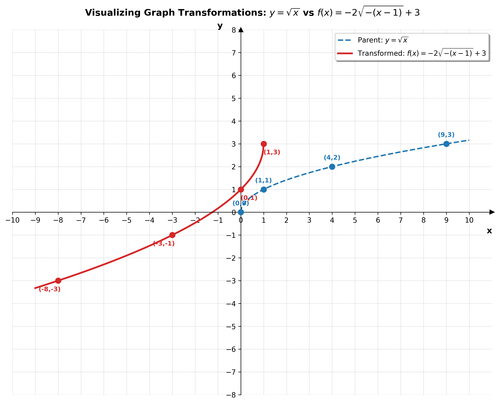

# Grade 9 Algebra: Mastering Graphing Transformations Lab

**Curriculum Unit:** Functions and Their Graphs  
**Section:** Graphing Techniques & Transformations (Section 3.5)

---

## Part 1: In-Class Guided Worksheet 

**Name:** ____________________________________ **Date:** _______________  

### Learning Objectives
1. **Objective 1:** Correctly prepare functions for graphing by factoring out horizontal coefficients first.
2. **Objective 2:** Execute transformations in the correct sequence: **Horizontal first, then Vertical**.
3. **Objective 3:** Apply the correct order of operations within each direction: **Multiplication/Division (Reflections/Stretches/Compressions) before Addition/Subtraction (Translations/Shifts)**.

---

### The Golden Rules of Transformations

Graphing transformations can be tricky, but if you follow these **three golden rules**, you will get the correct graph every single time!

> ### 🌟 Rule 1: Always Factor the Inside First!
> Before identifying horizontal transformations, factor out any coefficient of $$x$$. 
> *   *Example:* Turn $$\sqrt{-x + 1}$$ into $$\sqrt{-(x - 1)}$$. 
> *   **Why?** This isolates the horizontal shift, giving you the correct starting point. If you don't factor, your horizontal shift will be incorrect!
{: .note }

> ### 🌟 Rule 2: Horizontal First, Then Vertical!
> Apply all transformations inside the parent function (horizontal) **before** applying any transformations outside the parent function (vertical).
> $$\text{Horizontal Transformations} \quad \Longrightarrow \quad \text{Vertical Transformations}$$
{: .note }

> ### 🌟 Rule 3: Multiplication/Division before Addition/Subtraction (MD before AS)!
> In both horizontal and vertical directions, always apply reflections, stretches, and compressions ($$\times, \div$$) **before** shifts ($$+, -$$). Think of this as the Order of Operations (PEMDAS) for graphing!
> $$\text{Reflections, Stretches, and Compressions } (\times / \div) \quad \Longrightarrow \quad \text{Shifts/Translations } (+ / -)$$
{: .note }

---

## 🔍 Guided Example: Transforming the Square Root Function

We will graph the function:
$$f(x) = -2\sqrt{-x + 1} + 3$$

### Step 0: The Prep Work (Factoring)
Before doing anything else, look inside the square root: $$-x + 1$$. The coefficient of $$x$$ is $$-1$$. We must factor this out!
$$f(x) = -2\sqrt{-(x - 1)} + 3$$

*   **Parent Function:** $$y = \sqrt{x}$$
*   **Base Coordinates:** $$(0,0)$$, $$(1,1)$$, $$(4,2)$$, $$(9,3)$$

---

### 🗺️ The Step-by-Step Transformation Map

#### Phase A: Horizontal Transformations (Inside the Radical)
*Inside the radical, we have $$-(x - 1)$$. Following **Rule 3 (MD before AS)**, we do the horizontal reflection (multiplication by $$-1$$) before the horizontal shift (subtraction of $$1$$).*

1.  **Start with the Parent Function:**  
    *   **Equation:** $$y_0 = \sqrt{x}$$
    *   **Description:** The basic square root graph starting at $$(0,0)$$.
    *   **Point Mapping:** $$(x, y)$$

2.  **Horizontal Reflection (Reflect across $$y$$-axis):**  
    *   **Equation:** $$y_1 = \sqrt{-x}$$
    *   **Action (MD):** Replace $$x$$ with $$-x$$.
    *   **Coordinate Effect:** Multiply all $$x$$-coordinates by $$-1$$.
    *   **Point Mapping:** $$(x, y) \longrightarrow (-x, y)$$

3.  **Horizontal Translation (Shift Right by 1 unit):**  
    *   **Equation:** $$y_2 = \sqrt{-(x - 1)}$$
    *   **Action (AS):** Replace $$x$$ with $$(x-1)$$.
    *   **Coordinate Effect:** Add $$1$$ to all $$x$$-coordinates.
    *   **Point Mapping:** $$(-x, y) \longrightarrow (-x + 1, y)$$

#### Phase B: Vertical Transformations (Outside the Radical)
*Now that horizontal transformations are complete, we move outside where we have $$-2 \cdot (\text{radical}) + 3$$. Following **Rule 3 (MD before AS)**, we do the vertical stretch and reflection (multiplication by $$-2$$) before the vertical shift (addition of $$3$$).*

4.  **Vertical Reflection & Stretch (Reflect across $$x$$-axis and Stretch by 2):**  
    *   **Equation:** $$y_3 = -2\sqrt{-(x - 1)}$$
    *   **Action (MD):** Multiply the expression by $$-2$$.
    *   **Coordinate Effect:** Multiply all $$y$$-coordinates by $$-2$$.
    *   **Point Mapping:** $$(-x + 1, y) \longrightarrow (-x + 1, -2y)$$

5.  **Vertical Translation (Shift Up by 3 units):**  
    *   **Equation:** $$f(x) = -2\sqrt{-(x - 1)} + 3$$
    *   **Action (AS):** Add $$3$$ to the expression.
    *   **Coordinate Effect:** Add $$3$$ to all $$y$$-coordinates.
    *   **Point Mapping:** $$(-x + 1, -2y) \longrightarrow (-x + 1, -2y + 3)$$

---

#### 📊 Guided Coordinate Tracking Table

Let's trace how our four base points change through each of these steps:
-

#### 📈 Graph Visualization
Here is how the parent function and final transformed function compare visually:

---

### ⚠️ Concept Check: The "Forget to Factor" Trap

Let's see what happens if we forget to factor the inside and graph $$f(x) = -2\sqrt{-x+1} + 3$$ directly.

Suppose a student says: 
> *"Inside the radical is $$-x+1$$. The $$-$$ means reflect horizontally across the $$y$$-axis, and the $$+1$$ means shift left by 1 unit."*

Let's test this student's claim on our starting point $$(4,2)$$:
1.  **Reflect Horizontally:** $$(4,2) \longrightarrow (-4, 2)$$
2.  **Shift Left 1:** $$(-4, 2) \longrightarrow (-5, 2)$$
3.  **Reflect & Stretch Vertically:** $$(-5, 2) \longrightarrow (-5, -4)$$
4.  **Shift Up 3:** $$(-5, -4) \longrightarrow (-5, -1)$$

**Does the point $$(-5, -1)$$ actually lie on our function $$f(x) = -2\sqrt{-x+1} + 3$$?**  
Let's plug in $$x = -5$$:
$$f(-5) = -2\sqrt{-(-5) + 1} + 3 = -2\sqrt{5 + 1} + 3 = -2\sqrt{6} + 3 \approx -2(2.45) + 3 = -1.9$$
Since $$f(-5) \approx -1.9 \neq -1$$, the point is **INCORRECT**! 

**Key Takeaway:** If you do not factor out the horizontal coefficient first, your horizontal shifts will move in the wrong direction or by the wrong amount! Always factor first!

---

## Part 2: Student Practice Lab

Complete the following three tasks sourced and adapted from **Section 3.5 of your textbook (Transformation.pdf)**. Show your factoring step, list the transformations in the correct order, and fill in the coordinate tracking tables.

### 🎯 Task A: Horizontal Change Only (Requires Factoring)
*This task focuses entirely on the horizontal transformations inside the radical.*

Graph the function:
$$p(x) = \sqrt{2 - x}$$

#### 1. Factoring Step:
Factor out the coefficient of $$x$$ inside the radical:
$$p(x) = \sqrt{ \text{________________} }$$

#### 2. Identify the Parent Function and Base Points:
*   **Parent Function:** $$y = \sqrt{x}$$
*   **Base Points:** $$(0,0)$$, $$(1,1)$$, $$(4,2)$$, $$(9,3)$$

#### 3. List the Transformations in Order:
1.  **Horizontal Reflection/Stretch:** __________________________________________________
2.  **Horizontal Shift:** ____________________________________________________________________

#### 4. Coordinate Tracking Table:

| Step | Operation / Action | Point 1 | Point 2 | Point 3 | Point 4 |
| :---: | :--- | :---: | :---: | :---: | :---: |
| **0** | **Parent Function:** $$y = \sqrt{x}$$ | $$(0,0)$$ | $$(1,1)$$ | $$(4,2)$$ | $$(9,3)$$ |
| **1** | **Horizontal Reflection:** | | | | |
| **2** | **Horizontal Shift:** | | | | |

---

### 🎯 Task B: Vertical Change Only
*(Sourced from Section 3.5, Problem 58)*  
*This task focuses entirely on the vertical transformations outside the radical.*

Graph the function:
$$q(x) = -4\sqrt{x} - 1$$

#### 1. Identify the Parent Function and Base Points:
*   **Parent Function:** $$y = \sqrt{x}$$
*   **Base Points:** $$(0,0)$$, $$(1,1)$$, $$(4,2)$$, $$(9,3)$$

#### 2. List the Transformations in Order:
1.  **Vertical Reflection/Stretch:** __________________________________________________
2.  **Vertical Shift:** ____________________________________________________________________

#### 3. Coordinate Tracking Table:

| Step | Operation / Action | Point 1 | Point 2 | Point 3 | Point 4 |
| :---: | :--- | :---: | :---: | :---: | :---: |
| **0** | **Parent Function:** $$y = \sqrt{x}$$ | $$(0,0)$$ | $$(1,1)$$ | $$(4,2)$$ | $$(9,3)$$ |
| **1** | **Vertical Stretch/Reflect:** | | | | |
| **2** | **Vertical Shift:** | | | | |

---

### 🎯 Task C: Combine All Together (The Complete Challenge)
*(Sourced from Section 3.5, Problem 60)*  
*This task integrates factoring, horizontal changes, and vertical changes into a single function.*

Graph the function:
$$g(x) = 4\sqrt{2 - x}$$

#### 1. Factoring Step:
Factor out the coefficient of $$x$$ inside the radical:
$$g(x) = 4\sqrt{ \text{________________} }$$

#### 2. List the Transformations in Order:
*   **Horizontal (Inside):**
    1.  Horizontal Reflection: _______________________________________________________________
    2.  Horizontal Shift: ____________________________________________________________________
*   **Vertical (Outside):**
    3.  Vertical Stretch: ____________________________________________________________________

#### 3. Coordinate Tracking Table:

| Step | Operation / Action | Point 1 | Point 2 | Point 3 | Point 4 |
| :---: | :--- | :---: | :---: | :---: | :---: |
| **0** | **Parent Function:** $$y = \sqrt{x}$$ | $$(0,0)$$ | $$(1,1)$$ | $$(4,2)$$ | $$(9,3)$$ |
| **1** | **Horizontal Reflection:** | | | | |
| **2** | **Horizontal Shift:** | | | | |
| **3** | **Vertical Stretch:** | | | | |

---

### 🧠 Critical Thinking Discussion Questions

1.  **The Interdependence of Steps:** Look closely at Task A ($$p(x) = \sqrt{2-x}$$) and Task C ($$g(x) = 4\sqrt{2-x}$$). Notice that the horizontal steps are identical. How does adding the vertical stretch of $$4$$ in Task C affect the horizontal domain? Explain.
    __________________________________________________________________________________________
    __________________________________________________________________________________________

2.  **Reflecting first vs. Shifting first:** If you shift right by 2 first on $$y = \sqrt{x}$$, and then apply the horizontal reflection $$x \to -x$$, why does this sequence create $$y = \sqrt{-x-2}$$ instead of $$y = \sqrt{-(x-2)}$$? Detail the coordinate mathematics.
    __________________________________________________________________________________________
    __________________________________________________________________________________________

---

## Part 3: Teacher's Answer Key & Solutions

### 🎯 Task A Answer Key: $$p(x) = \sqrt{-(x - 2)}$$
1.  **Factored Form:** $$p(x) = \sqrt{-(x - 2)}$$
2.  **List of Transformations:**
    *   Horizontal reflection (across the $$y$$-axis) $\rightarrow$ replace $$x$$ with $$-x$$.
    *   Horizontal translation **right** by $$2$$ units $\rightarrow$ replace $$x$$ with $$(x - 2)$$.
3.  **Completed Coordinate Table:**

| Step | Operation | Point 1 | Point 2 | Point 3 | Point 4 |
| :---: | :--- | :---: | :---: | :---: | :---: |
| **0** | $$y = \sqrt{x}$$ | $$(0,0)$$ | $$(1,1)$$ | $$(4,2)$$ | $$(9,3)$$ |
| **1** | Horiz. Reflection ($$\times -1$$ to $$x$$) | $$(0,0)$$ | $$(-1,1)$$ | $$(-4,2)$$ | $$(-9,3)$$ |
| **2** | Horiz. Shift Right 2 ($$+2$$ to $$x$$) | **$$(2,0)$$** | **$$(1,1)$$** | **$$(-2,2)$$** | **$$(-7,3)$$** |

---

### 🎯 Task B Answer Key: $$q(x) = -4\sqrt{x} - 1$$
1.  **List of Transformations:**
    *   Vertical reflection (across $$x$$-axis) and vertical stretch by a factor of $$4$$ $\rightarrow$ multiply $$y$$ by $$-4$$.
    *   Vertical translation **down** by $$1$$ unit $\rightarrow$ subtract $$1$$ from $$y$$.
2.  **Completed Coordinate Table:**

| Step | Operation | Point 1 | Point 2 | Point 3 | Point 4 |
| :---: | :--- | :---: | :---: | :---: | :---: |
| **0** | $$y = \sqrt{x}$$ | $$(0,0)$$ | $$(1,1)$$ | $$(4,2)$$ | $$(9,3)$$ |
| **1** | Vert. Reflect & Stretch ($$\times -4$$ to $$y$$) | $$(0,0)$$ | $$(1,-4)$$ | $$(4,-8)$$ | $$(9,-12)$$ |
| **2** | Vert. Shift Down 1 ($$-1$$ to $$y$$) | **$$(0,-1)$$** | **$$(1,-5)$$** | **$$(4,-9)$$** | **$$(9,-13)$$** |

---

### 🎯 Task C Answer Key: $$g(x) = 4\sqrt{-(x - 2)}$$
1.  **Factored Form:** $$g(x) = 4\sqrt{-(x - 2)}$$
2.  **List of Transformations:**
    *   Horizontal reflection (across the $$y$$-axis).
    *   Horizontal translation **right** by $$2$$ units.
    *   Vertical stretch by a factor of $$4$$ (multiply all $$y$$-coordinates by $$4$$).
3.  **Completed Coordinate Table:**

| Step | Operation | Point 1 | Point 2 | Point 3 | Point 4 |
| :---: | :--- | :---: | :---: | :---: | :---: |
| **0** | $$y = \sqrt{x}$$ | $$(0,0)$$ | $$(1,1)$$ | $$(4,2)$$ | $$(9,3)$$ |
| **1** | Horiz. Reflection ($$\times -1$$ to $$x$$) | $$(0,0)$$ | $$(-1,1)$$ | $$(-4,2)$$ | $$(-9,3)$$ |
| **2** | Horiz. Shift Right 2 ($$+2$$ to $$x$$) | $$(2,0)$$ | $$(1,1)$$ | $$(-2,2)$$ | $$(-7,3)$$ |
| **3** | Vert. Stretch ($$\times 4$$ to $$y$$) | **$$(2,0)$$** | **$$(1,4)$$** | **$$(-2,8)$$** | **$$(-7,12)$$** |

---

### 💡 Answers to Critical Thinking Discussion Questions

1.  **The Interdependence of Steps:**  
    Adding the vertical stretch of $$4$$ **does not affect** the horizontal domain at all! The domain for both $$p(x)$$ and $$g(x)$$ remains $$x \le 2$$ (all real numbers less than or equal to 2). This demonstrates that vertical transformations (outside the parent function) and horizontal transformations (inside the parent function) are completely independent of each other with respect to domain limits.

2.  **Reflecting first vs. Shifting first:**  
    If you shift first, the graph becomes $$y = \sqrt{x - 2}$$. When you subsequently reflect by replacing $$x$$ with $$-x$$, you must replace **only the variable $$x$$ itself**, which yields $$y = \sqrt{-x - 2}$$. This is equivalent to $$\sqrt{-(x+2)}$$, which represents a shift **left** of 2. By factoring first into $$\sqrt{-(x-2)}$$, we know that the reflection $$x \rightarrow -x$$ and the shift $$x \rightarrow x-2$$ must occur sequentially, which maps directly to a **right** shift of 2 on the reflected curve.
