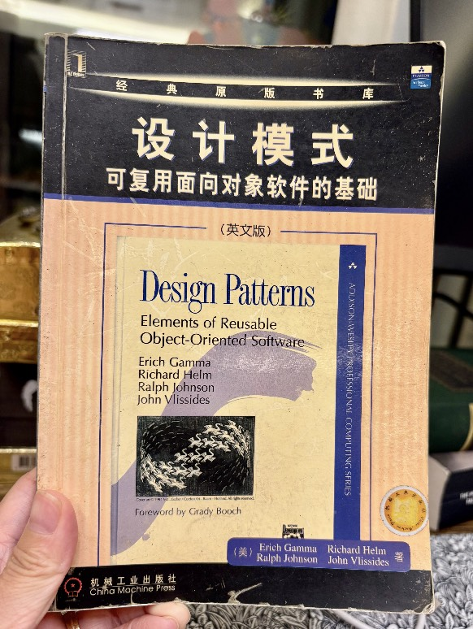

# Are Design Patterns Dying in the Age of AI?
{: .no_toc }

As a veteran software engineer, I spent years fighting production outages caused by careless bugs and wrestling with legacy systems that were fundamentally hard to scale.

**In the age of AI, bad code and fragile design have become commodities: cheap, abundant, and effortless to generate.**

Recently, I used a coding agent to build a financial tool. The AI completed in a few hours what might have taken a human developer weeks. It was astonishingly fast—and surprisingly low quality.

Every monetary value across the system was modeled as a raw `BigDecimal`. There was no concept of currency, no domain boundary, and no encapsulation.

> How can you add `100 HKD` to `100 USD` just because both happen to be a `BigDecimal`?

This is textbook **Primitive Obsession**. A seasoned engineer naturally introduces a **Value Object** (such as the classic *Money* pattern) to enforce currency checks and exchange conversions before arithmetic is even permitted. The AI, however, only saw numbers.

**You cannot count on AI to design for non-functional requirements.**

AI excels at localized functional features: *"Given input X, output Y."* It gets the happy path working, but in a tightly coupled, unscalable manner. It solves the immediate prompt while quietly accumulating crippling architectural debt.

**Design patterns are not dying—they are more essential than ever.**

When AI churns out code at machine speed, syntax and boilerplate lose their value. The engineer's real worth moves upstream to architectural judgment: establishing domain boundaries, selecting the right design patterns, and providing guardrails. 

Without design patterns and architectural discipline, AI only helps us manufacture legacy spaghetti code 100x faster.

---

